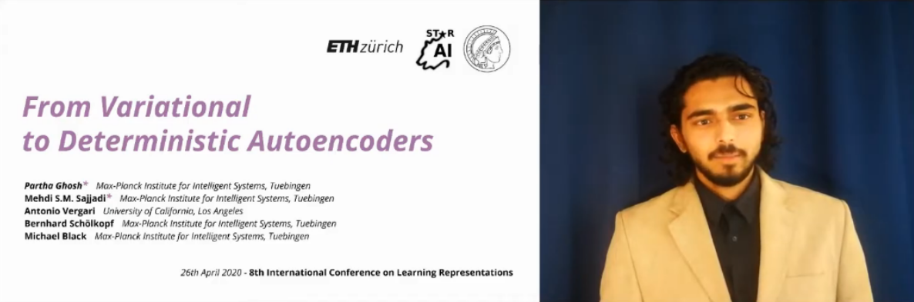
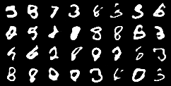
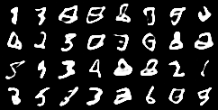
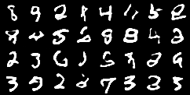
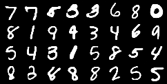
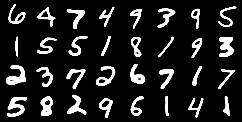
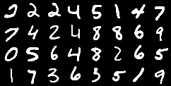

# Regularized-AutoEncoder
ICLR2020 Regularized AutoEncoder Pytorch version

This is the pytorch implementation of the ICLR2020 Paper titled 'From variational to deterministic Autoencoders'

The author's repo is [Regularized_autoencoders(RAE)](https://github.com/ParthaEth/Regularized_autoencoders-RAE-) 

```
@inproceedings{
ghosh2020from,
title={From Variational to Deterministic Autoencoders},
author={Partha Ghosh and Mehdi S. M. Sajjadi and Antonio Vergari and Michael Black and Bernhard Scholkopf},
booktitle={International Conference on Learning Representations},
year={2020},
url={https://openreview.net/forum?id=S1g7tpEYDS}
}

```

### A brief presentation of RAE

[](https://www.youtube.com/embed/TiIuFt1KvJ4)

### Paper link

https://openreview.net/forum?id=S1g7tpEYDS


### MNIST(Only)

- Sampled from **XPDE**(Ex-Post Density Estimation)

-- epoch=10


-- epoch=30


-- epoch=50


- Reconstruction Directly

-- epoch=10


-- epoch=30


-- epoch=50



